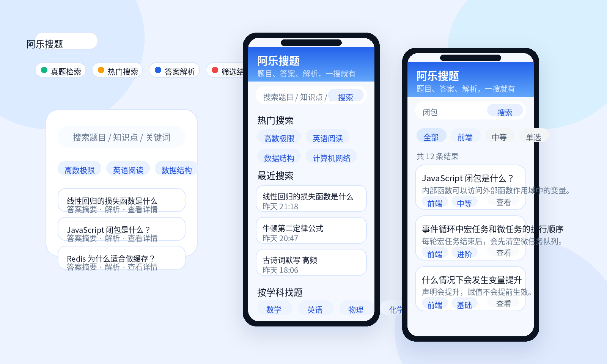
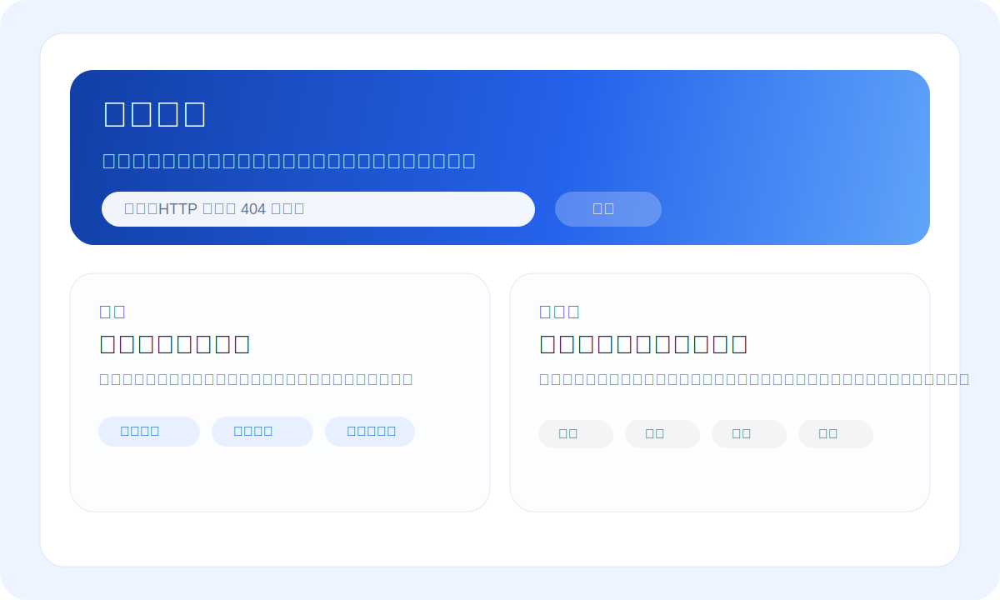
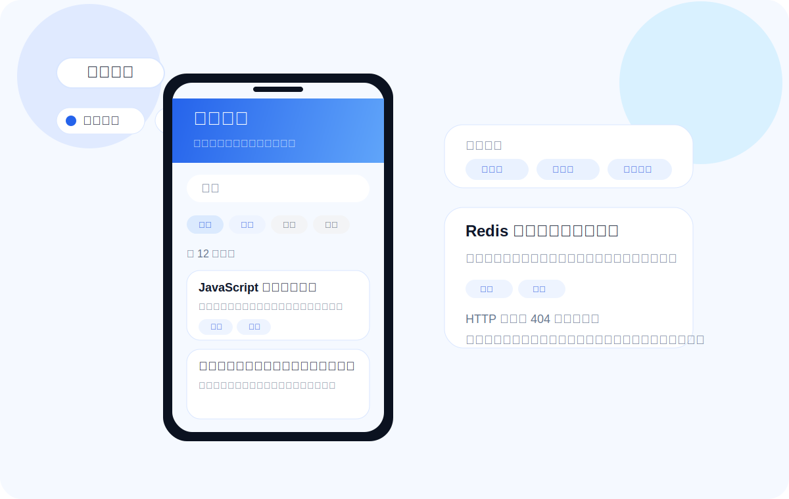
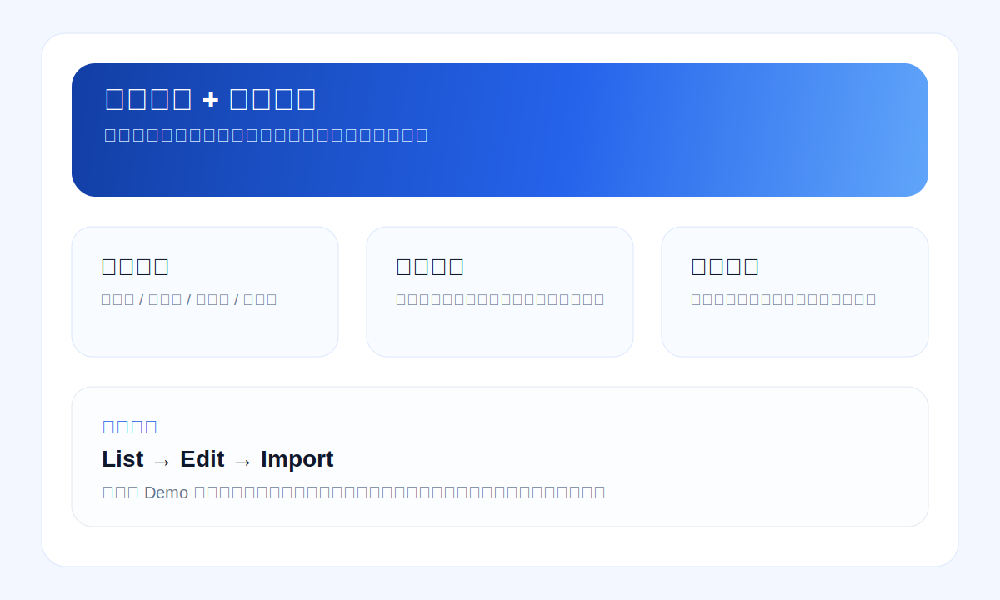

# 阿乐搜题 / WeChat Question Search Mini Program

一个可直接导入微信开发者工具的题库小程序项目，默认体验聚焦在三件事：**搜题、看结果、进详情**。

> GitHub repo: `HappyLee11/alesouQuestions`  
> 当前仓库目录：`wechat-question-miniapp`



## 产品预览

### 首页 / 搜索入口



### 搜索结果页



### 后台 / 导入工作台



## 体验概览

- 首页第一屏就是搜索框，支持热门搜索、最近搜索、按学科找题
- 搜索结果页支持关键词检索，以及按学科 / 难度 / 题型继续筛选
- 题目列表优先展示答案摘要，可进一步查看解析或进入详情页
- 管理能力保留在后台页与文档里，和普通用户浏览流分开

## 这是什么

这是一个可直接导入微信开发者工具的小程序题库项目，分成两层：

- **用户侧**：搜索入口、热门词、最近搜索、筛选结果、答案摘要、详情页
- **管理侧**：管理员校验、题目维护、批量导入、审核与生命周期管理

## 当前体验重点

### 1) 搜题入口更直接

- 首页第一屏就是搜索框
- 提供热门搜索、最近搜索、按学科找题
- 可直接进入结果页或题目详情页
- 文案保持用户态表达，避免首页出现技术 / 管理说明

### 2) 结果页更像正常使用流

- 关键词检索
- 热门词、最近搜索、相关推荐词
- 学科 / 难度 / 题型 / 标签筛选
- 答案摘要与展开解析
- 分页浏览与详情跳转

### 3) 管理能力保留在后台与文档

- 管理员权限校验
- 题目列表筛选、编辑、归档与恢复
- 批量导入、预检、任务回执
- 审核状态、生命周期与审计能力

## 页面结构

```text
miniprogram/pages/
├── home        # 用户首页 / 搜索入口
├── search      # 搜索结果页
├── detail      # 题目详情页
├── admin       # 管理后台首页
├── task-center # 后台任务中心
├── list        # 题目列表
├── edit        # 新增/编辑题目
└── import      # 批量导入与预检
```

## 快速开始

### 1. 环境准备

你需要：

- 微信开发者工具
- 一个小程序 AppID（没有也可先用游客模式调 UI）
- 一个云开发环境（若要跑真实后台动作）

### 2. 导入项目

在微信开发者工具中导入：

- **项目根目录**：`wechat-question-miniapp`
- **小程序目录**：`miniprogram`
- **云函数目录**：`cloudfunctions`

### 3. 配置云环境 ID

把以下文件中的 `your-cloud-env-id` 改成真实值：

- `miniprogram/app.js`
- `project.config.json`

### 4. 创建数据库集合

创建：

- `questions`
- `admins`
- `import_tasks`（推荐，用于导入任务中心 / 预检回执）
- `audit_logs`（推荐，用于后台审计轨迹）

### 5. 部署云函数

在微信开发者工具中逐个部署：

- `searchQuestions`
- `getQuestionDetail`
- `checkAdmin`
- `saveQuestion`
- `deleteQuestion`
- `importQuestions`

### 6. 初始化数据

推荐先用这些文件：

- `data/sample-questions.json`
- `data/import-template.csv`
- `data/import-workbook-manifest.json`
- `data/question-governance-schema.json`

### 7. 配置管理员

在 `admins` 集合中添加一条记录：

```json
{
  "openid": "your-openid",
  "name": "Primary Admin",
  "enabled": true,
  "role": "super_admin"
}
```

## 技术 / 架构概览

### 前端

- 微信小程序原生页面
- 页面位于 `miniprogram/pages/*`
- 公共样式集中在 `miniprogram/app.wxss`
- API 封装在 `miniprogram/utils/question.js`

### 云函数

- `searchQuestions`
- `getQuestionDetail`
- `checkAdmin`
- `saveQuestion`
- `deleteQuestion`
- `importQuestions`

### 数据层

建议使用云开发数据库：

- `questions`
- `admins`
- `import_tasks`（推荐，用于导入任务中心 / 预检回执）
- `audit_logs`（推荐，用于后台审计轨迹）

### 运行模式

- **搜索 / 详情**：支持 mock fallback，方便本地调试与 UI 联调
- **管理动作**：需要真实云函数与管理员权限
- **导入动作**：需要真实 `importQuestions` 云函数

更多说明见：

- [`docs/setup.md`](./docs/setup.md)
- [`docs/first-run-checklist.md`](./docs/first-run-checklist.md)
- [`docs/architecture.md`](./docs/architecture.md)
- [`docs/import-normalization.md`](./docs/import-normalization.md)
- [`docs/governance-model.md`](./docs/governance-model.md)
- [`docs/demo-script.md`](./docs/demo-script.md)
- [`docs/release-prep-0.1.2.md`](./docs/release-prep-0.1.2.md)

## 建议查看顺序

如果你第一次打开这个仓库，建议按下面顺序看：

1. `README.md`
2. `docs/setup.md`
3. `docs/architecture.md`
4. `miniprogram/pages/home`
5. `miniprogram/pages/search`
6. `miniprogram/pages/admin`
7. `cloudfunctions/*`

## License

当前仓库未单独声明 License；如要公开分发，建议补充许可证说明。
